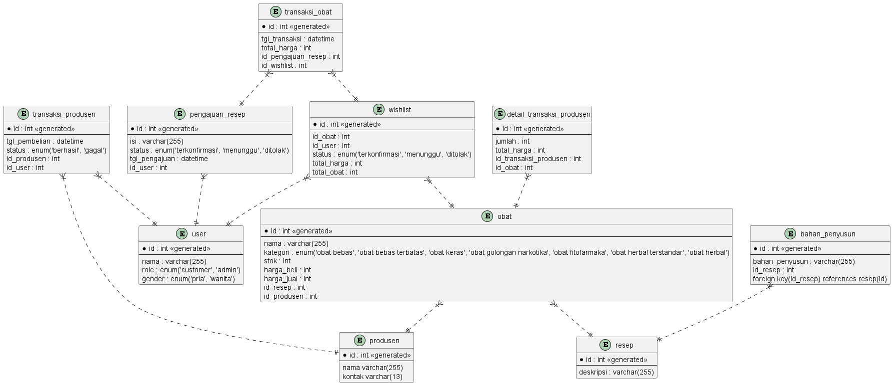

# Modul 2

## Database Manajemen Apotek

## Studi Kasus

Sistem manajemen apotek merupakan sistem yang membantu pengguna dalam proses pembelian obat, serta membantu admin dalam memanajemen stok, pembelian, dan distribusi obat ke konsumen. Obat obatan dikategorikan menjadi 7 berdasarkan standar kesehatan yaitu obat bebas, obat bebas terbatas, obat keras, obat golongan narkotika, obat fitofarmaka, obat herbal terstandar, obat herbal. Customer dapat memesan obat secara online melalui sistem, dengan mengunggah resep dokter (Gambar/hasil Scan) melalui fitur pengajuan atau mencari secara langsung nama obat yang bersangkutan. Melalui sistem ini admin dapat melakukan tracking stok keseluruhan obat, dan melakukan pemesanan kepada produsen-produsen terdaftar. Apotek dapat melakukan produksi resep secara mandiri, sehingga sistem menyediakan fitur dimana admin dapat melakukan pendataan terkait resep dari suatu obat.

Hanya Obat dengan kategori fitofarmaka, obat herbal terstandar, dan obat herbal yang mampu diproduksi secara mandiri. Sehingga obat obat terkategorisasi lagi menjadi 2, yaitu yang dapat diproduksi secara mandiri, dan yang harus dipesan pada produsen.

## Diagram



## Report

### Tampilkan total customer yang memesan menggunakan pengajuan resep dokter dalam 3 bulan terakhir!

```
SELECT
  COUNT(DISTINCT user.id) AS total_customers
FROM
  user
  JOIN pengajuan_resep ON user.id = pengajuan_resep.id_user
WHERE
  pengajuan_resep.tgl_pengajuan >= DATE_SUB(CURDATE(), INTERVAL 3 MONTH);
```

### Tampilkan produsen dengan total transaksi terbanyak dalam 1 bulan!

```
SELECT
  produsen.nama,
  COUNT(transaksi_produsen.id) AS total_transaksi
FROM
  transaksi_produsen
  JOIN produsen ON transaksi_produsen.id_produsen = produsen.id
WHERE
  MONTH(transaksi_produsen.tgl_pembelian) = MONTH(CURRENT_DATE - INTERVAL 1 MONTH)
  AND YEAR(transaksi_produsen.tgl_pembelian) = YEAR(CURRENT_DATE - INTERVAL 1 MONTH)
GROUP BY
  produsen.nama
ORDER BY
  total_transaksi DESC
LIMIT
  1;
```

### Tampilkan kategori obat dengan penjualan terendah dalam 1 tahun!

```
SELECT
  obat.kategori,
  SUM(wishlist.total_obat) AS total_penjualan
FROM
  wishlist
  JOIN transaksi_obat ON wishlist.id = transaksi_obat.id_wishlist
  JOIN obat ON wishlist.id_obat = obat.id
WHERE
  transaksi_obat.tgl_transaksi >= DATE_SUB(NOW(), INTERVAL 1 YEAR)
GROUP BY
  obat.kategori
ORDER BY
  total_penjualan ASC
LIMIT
  1;
```
