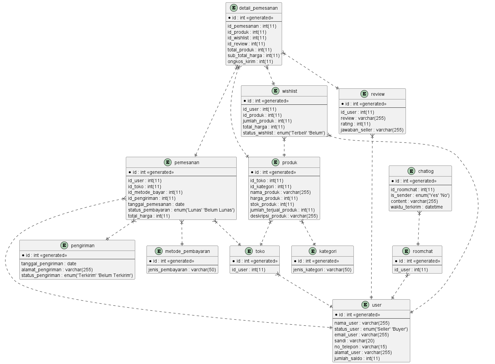

# Modul 1

## Database Marketplace

## Studi Kasus

TokoPDI merupakan salah satu marketplace dimana memungkinkan penggunanya melakukan atau membuat bisnis online mereka secara mudah dan gratis. User pada marketplace ini adalah member yang terdaftar melalui email dan nomor telepon. Sebagai member, pengguna dapat melakukan pembelian produk yang diinginkan. Untuk membuka bisnis atau mendaftar sebagai admin toko/seller di TokoPDI, pengguna bisa mendaftar diri dengan data member sebagai syaratnya. Setiap admin toko/seller dapat mengelompokkan produk mereka berdasarkan kategori yang mereka buat, seperti contoh, teknologi, pakaian, dll. Pada marketplace ini juga memiliki room chat untuk pengguna bisa bertanya perihal produk kepada admin toko.

Produk-produk yang ada pada marketplace diinput oleh admin toko itu sendiri. Ketika pengunjung merasa tertarik dengan produk ia bisa langsung melakukan order pemesanan atau ia juga bisa dapat menambahkannya ke dalam fitur wishlist. Fitur wishlist ini berisi daftar produk yang ditandai pengunjung dimana ingin dibeli kemudian hari. Pembayaran yang dilakukan terhadap pemesanan produk dapat dilakukan melalui transfer bank, COD, atau bisa dengan kartu kredit. Setelah pemesanan produk berhasil, pengguna harus memberikan review & rating 1-5 untuk produk yang telah di ordernya.

## Diagram



## Report

### Tampilkan rata-rata pengeluaran user dalam kurun waktu 1 bulan!

```

SELECT
  id_user,
  AVG(total_harga) AS rata_rata_pengeluaran
FROM
  (
    SELECT
      p.id_user,
      SUM(dp.sub_total_harga + dp.ongkos_kirim) AS total_harga
    FROM
      pemesanan p
      JOIN detail_pemesanan dp ON p.id = dp.id_pemesanan
    WHERE
      p.tanggal_pemesanan BETWEEN DATE_ADD(NOW(), INTERVAL -1 MONTH)
      AND NOW()
      AND p.status_pembayaran = 'Lunas'
    GROUP BY
      p.id_user,
      p.id
  ) AS t
GROUP BY
  id_user;
```

### Tampilkan review dari metode COD yang memiliki rating bintang 1!

```
SELECT
  r.id_user,
  r.rating,
  r.review,
  r.jawaban_seller
FROM
  review r
  JOIN detail_pemesanan dp ON r.id = dp.id_review
  JOIN pemesanan p ON dp.id_pemesanan = p.id
  JOIN metode_pembayaran mb ON p.id_metode_bayar = mb.id
WHERE
  mb.jenis_pembayaran LIKE '%COD%'
  AND r.rating = 1;
```

### Tampilkan transaksi yang dilakukan oleh salah satu costumer dalam waktu 3 bulan!

```
SELECT
  pemesanan.id_user,
  pemesanan.tanggal_pemesanan,
  detail_pemesanan.total_produk,
  detail_pemesanan.sub_total_harga,
  detail_pemesanan.ongkos_kirim,
  (
    detail_pemesanan.sub_total_harga + detail_pemesanan.ongkos_kirim
  ) AS total_biaya
FROM
  detail_pemesanan
  INNER JOIN pemesanan ON detail_pemesanan.id_pemesanan = pemesanan.id
WHERE
  pemesanan.tanggal_pemesanan BETWEEN DATE_ADD(NOW(), INTERVAL -3 MONTH)
  AND NOW();
```
