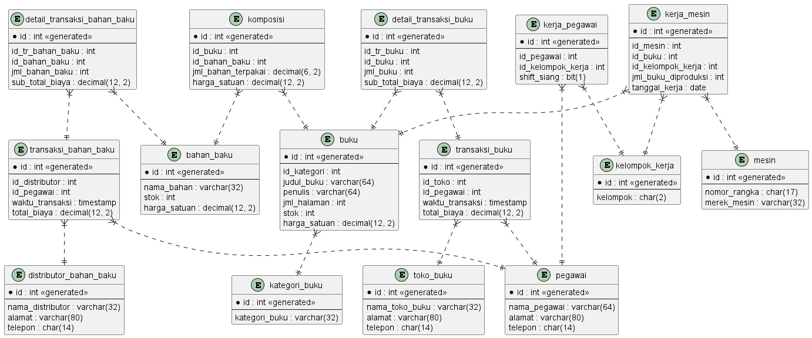

# Modul 1

## Database Percetakan Buku

## Studi Kasus

Sebuah perusahan percetakan buku memiliki beberapa mesin untuk melakukan produksi buku. Setiap mesin memiliki daftar proses berbeda untuk produksi judul buku tertentu, yang diatur berdasarkan tanggal. Selain itu sistem memiliki kemampuan dalam proses pemesanan bahan baku dari beberapa distributor. Proses produksi juga diatur oleh beberapa pegawai dengan pembagian shift kerja antara siang atau malam, dan tersimpan dalam database. Bahan-bahan yang digunakan dalam proses produksi sebuah judul buku akan disimpan dan diproses untuk menghitung harga modal pembuatannya. Setelah itu semua buku diberikan kategori untuk mempermudah pengelompokan. Admin juga mengatur proses distribusi ke toko toko buku di kota tersebut. Proses transaksi distribusi dilakukan dengan mencatat judul buku, jumlah buku, harga satuan, tujuan pengiriman, waktu pengiriman.

## Diagram



## Report

### Tampilkan 3 buku dengan modal pembuatan terbesar!

```
SELECT
  buku.judul_buku,
  SUM(
    komposisi.jml_bahan_terpakai * komposisi.harga_satuan
  ) as harga_modal
FROM
  buku
  INNER JOIN komposisi ON buku.id = komposisi.id_buku
GROUP BY
  buku.id
ORDER BY
  harga_modal DESC
LIMIT
  3;
```

### Tampilkan pegawai yang bekerja di hari tanggal tertentu pada shift malam!

```
SELECT
  pegawai.nama_pegawai,
  kerja_mesin.tanggal_kerja,
  kelompok_kerja.kelompok
FROM
  pegawai
  JOIN kerja_pegawai ON pegawai.id = kerja_pegawai.id_pegawai
  JOIN kelompok_kerja ON kelompok_kerja.id = kerja_pegawai.id_kelompok_kerja
  JOIN kerja_mesin ON kelompok_kerja.id = kerja_mesin.id_kelompok_kerja
WHERE
  kerja_pegawai.shift_siang = 0
  AND DAY(kerja_mesin.tanggal_kerja) = 23
ORDER BY
  kerja_mesin.tanggal_kerja ASC;
```

### Tampilkan penjualan buku dengan kategori tertentu dalam 1 bulan!

```
SELECT
  transaksi_buku.id as id_transaksi_buku,
  MONTHNAME(transaksi_buku.waktu_transaksi) AS bulan_transaksi,
  buku.judul_buku,
  detail_transaksi_buku.jml_buku,
  detail_transaksi_buku.sub_total_biaya,
  kategori_buku.kategori_buku
FROM
  transaksi_buku
  JOIN detail_transaksi_buku ON transaksi_buku.id = detail_transaksi_buku.id_tr_buku
  JOIN buku ON detail_transaksi_buku.id_buku = buku.id
  JOIN kategori_buku ON buku.id_kategori = kategori_buku.id
WHERE
  kategori_buku = "Novel"
  AND MONTHNAME(transaksi_buku.waktu_transaksi) = "April"
ORDER BY
  transaksi_buku.id ASC;
```
