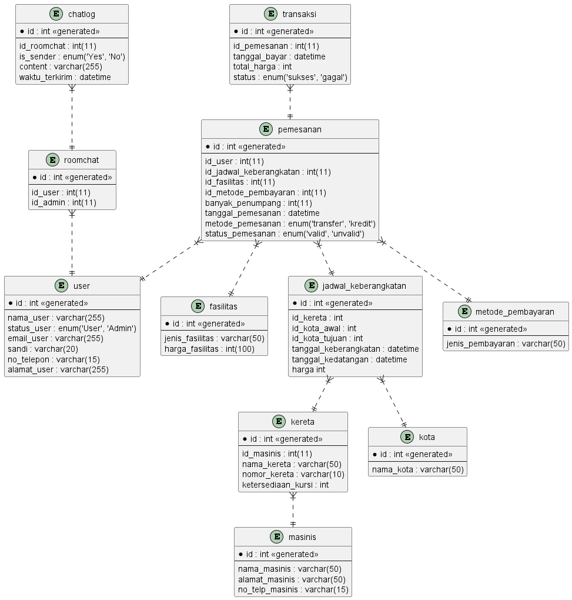

# Modul 1

## Database Manajemen Stasiun Kereta Api

## Studi Kasus

Sebuah stasiun kereta Api memiliki sebuah sistem yang membantu pengguna dalam menikmati fasilitas kendaraan publik tersebut. Sistem tersebut terdiri dari fitur penjualan tiket kereta api secara online. Untuk melakukan pemesanan pengguna harus mendaftar sebagai member terlebih dahulu pada Sistem tersebut. Pengguna dapat memesan Rute perjalanan tertentu beserta kelas fasilitas yang diinginkan, yaitu Gold, Silver, & Bronze. Setiap rute telah memiliki daftar kereta dengan waktu penjemputan yang berbeda beda di masing masing stasiun. Detail kereta beserta masinis pun di data dalam sistem tersebut. Penumpang yang telah memesan akan mendapatkan informasi stasiun penjemputan dan tujuan, nomor gerbong serta kursi di kereta tersebut. Admin pun dapat mengatur atau menambahkan rute perjalanan antar stasiun, kereta yang digunakan, serta masinis yang mengendarainya.

## Diagram



## Report

### Tampilkan rute perjalanan mana yang paling banyak dipesan!

```
SELECT
  id_jadwal_keberangkatan,
  COUNT(*) AS jumlah_pemesanan
FROM
  pemesanan
GROUP BY
  id_jadwal_keberangkatan
ORDER BY
  jumlah_pemesanan DESC;
```

### Tampilkan nama kereta yang digunakan lebih dari 1 Rute perjalanan!

```
SELECT
  kereta.nama_kereta,
  COUNT(*) AS banyak_rute
FROM
  jadwal_keberangkatan
  JOIN kereta ON jadwal_keberangkatan.id_kereta = kereta.id
GROUP BY
  nama_kereta
HAVING
  banyak_rute > 1
ORDER BY
  banyak_rute DESC;
```

### Tampilkan rute perjalanan yang ditugaskan pada masinis tertentu!

```
SELECT
  masinis.nama_masinis,
  jadwal_keberangkatan.id AS rute
FROM
  masinis
  JOIN kereta ON kereta.id_masinis = masinis.id
  JOIN jadwal_keberangkatan ON jadwal_keberangkatan.id = kereta.id;
```
